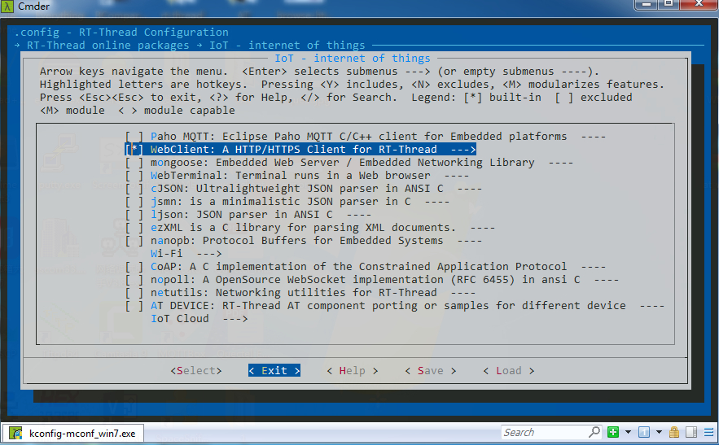

# 使用指南

本节主要介绍 WebClient 软包的基本使用流程， 并针对使用过程中经常涉及到的结构体和重要 API 进行简要说明。

## 准备工作

首先需要下载 WebClient 软件包，并将软件包加入到项目中。在 BSP 目录下使用 menuconfig 命令打开 env 配置界面，在 `RT-Thread online packages → IoT - internet of things` 中选择 WebClient 软件包，操作界面如下图所示：



详细配置介绍如下所示：

```shell
RT-Thread online packages
    IoT - internet of things  --->
         [*] WebClient: A HTTP/HTTPS Client for RT-Thread
         [ ]   Enable debug log output
         [ ]   Enable webclient GET/POST samples
               Select TLS mode (Not support)  --->
                   (x) Not support
                   ( ) SAL TLS support
                   ( ) MbedTLS support
              Version (latest)  --->
```

**Enable debug log output**：开启调试日志显示，可以用于查看请求和响应的头部数据信息；

**Enable webclient GET/POST samples** ：添加示例代码；

**Select TLS mode** ：配置开启 HTTPS 支持，选择支持的模式；

- **Not support**：不支持 TLS 功能；
- **SAL TLS support**：配置 SAL 组件中 TLS 功能支持，SAL 组件中抽象 TLS 操作，用户还需要**手动配置开启使用的 TLS 软件包类型**（目前只支持 MbedTLS 软件包）；
- **MbedTLS support**：配置 MbedTLS 功能支持；

**Version** ：配置软件包版本号。

选择合适的配置项后，使用 `pkgs --update` 命令下载软件包并更新用户配置。


## 使用流程

使用 WebClient 软件包发送 GET/POST 请求一般需要完成如下基本流程：

（1） **创建客户端会话结构体**

```c
struct  webclient_header
{
    char *buffer;                       //添加或者获取的头部数据
    size_t length;                      //存放当前头部数据长度

    size_t size;                        //存放最大支持的头部数据长度
};

struct webclient_session
{
    struct webclient_header *header;    //保存头部信息结构体
    int socket;                         //当前连接套接字
    int resp_status;                    //响应状态码

    char *host;                         //连接服务器地址
    char *req_url;                      //连接的请求地址

    int chunk_sz;                       //chunk 模式下一块数据大小
    int chunk_offset;                   //chunk 模式剩余数据大小

    int content_length;                 //当前接收数据长度（非 chunk 模式）
    size_t content_remainder;           //当前剩余接收数据长度
    
    rt_bool_t is_tls;                   //当前连接是否是 HTTPS 连接
#ifdef WEBCLIENT_USING_MBED_TLS
    MbedTLSSession *tls_session;        // HTTPS 协议相关会话结构体
#endif
};
```

`webclient_session` 结构体用于存放当前建立的 HTTP 连接的部分信息，可用与 HTTP 数据交互整个流程。建立 HTTP 连接前需要创建并初始化该结构体，创建的方式示例如下：

```c
struct webclient_session *session = RT_NULL;

/* create webclient session and set header response size */
session = webclient_session_create(1024);
if (session == RT_NULL)
{
    ret = -RT_ENOMEM;
    goto __exit;
}
```

（2） **拼接头部数据**

 WebClient 软件包提供两种请求头部发送方式：

 - 默认头部数据

    如果要使用默认的头部信息，则不需要拼接任何头部数据，可直接调用 GET 发送命令。默认头部数据一般只用于 GET 请求。

 - 自定义头部数据

自定义头部数据使用 `webclient_header_fields_add` 函数添加头部信息，添加的头部信息位于客户端会话结构体中，在发送 GET/POST 请求时发送。

添加示例代码如下：

```c
/* 拼接头部信息 */
webclient_header_fields_add(session, "Content-Length: %d\r\n", strlen(post_data));

webclient_header_fields_add(session, "Content-Type: application/octet-stream\r\n");
```

（3） **发送 GET/POST 请求**

头部信息添加完成之后，就可以调用 `webclient_get` 函数或者 `webclient_post` 函数发送 GET/POST 请求命令了，函数中主要操作如下：

- 通过传入的 URI 获取信息，建立 TCP 连接；

- 发送默认或者拼接的头部信息；

- 接收并解析响应数据的头部信息；

- 返回错误或者响应状态码。

发送 GET 请求示例代码如下：

```c
int resp_status = 0;

/* send GET request by default header */
if ((resp_status = webclient_get(session, URI)) != 200)
{
    LOG_E("webclient GET request failed, response(%d) error.", resp_status);
    ret = -RT_ERROR;
    goto __exit;
}
```

（4） **接收响应的数据**

发送 GET/POST 请求之后，可以使用 `webclient_read` 函数接收响应的实际数据。因为响应的实际数据可能比较长，所以往往我们需要循环接收响应数据，指导数据接收完毕。

如下所示为循环接收并打印响应数据方式：

```c
int content_pos = 0;
/* 获取接收的响应数据长度 */
int content_length = webclient_content_length_get(session);

/* 循环接收响应数据直到数据接收完毕 */
do
{
    bytes_read = webclient_read(session, buffer, 1024);
    if (bytes_read <= 0)
    {
        break;
    }

    /* 打印响应数据 */
    for (index = 0; index < bytes_read; index++)
    {
        rt_kprintf("%c", buffer[index]);
    }

    content_pos += bytes_read;
} while (content_pos < content_length);
```

（5） **关闭并释放客户端会话结构体**

请求发送并接收完成之后，需要使用 `webclient_close` 函数关闭并释放客户端会话结构体，完成整个 HTTP 数据交互流程。

使用方式如下：

```c
if (session)
{
    webclient_close(session);
}
```

## 使用方式

WenClient 软件包对于 GET/POST 请求，分别提供了几种不同的使用方式，用于不同的情况。

### GET 请求方式

- 使用默认头部发送 GET 请求

```c
struct webclient_session *session = NULL;

session = webclient_create(1024);

if(webclient_get(session, URI) != 200)
{
    LOG_E("error!");
}

while(1)
{
    webclient_read(session, buffer, bfsz);
    ...
} 

webclient_close(session);
```

- 使用自定义头部发送 GET 请求

```c
struct webclient_session *session = NULL;

session = webclient_create(1024);

webclient_header_fields_add(session, "User-Agent: RT-Thread HTTP Agent\r\n");

if(webclient_get(session, URI) != 200)
{
    LOG_E("error!");
}

while(1)
{
    webclient_read(session, buffer, bfsz);
    ...
} 

webclient_close(session);
```

- 发送获取部分数据的 GET 请求（多用于断点续传）

```c
struct webclient_session *session = NULL;

session = webclient_create(1024);

if(webclient_get_position(URI, 100) != 206)
{
    LOG_E("error!");
}

while(1)
{
    webclient_read(session, buffer, bfsz);
    ...
} 

webclient_close(session)；
```

- 使用 `webclient_response` 接收 GET 数据

    多用于接收数据长度较小的 GET 请求。

```c
struct webclient_session *session = NULL;
char *result;

session = webclient_create(1024);

if(webclient_get(session, URI) != 200)
{
    LOG_E("error!");
}

webclient_response(session, &result);

web_free(result);
webclient_close(session);
```

- 使用 `webclient_request` 函数发送并接收 GET 请求

    多用于接收数据长度较小，且头部信息已经拼接给出的 GET 请求。

```c
char *result, *header = RT_NULL;

/* 拼接自定义头部数据 */
webclient_request_header_add(&header, "User-Agent: RT-Thread HTTP Agent\r\n");

webclient_request(URI, header, NULL, &result);

web_free(result);
```

### POST 请求方式

- 分段数据 POST 请求

    多用于上传数据量较大的 POST 请求，如：上传文件到服务器。

```c
struct webclient_session *session = NULL;

session = webclient_create(1024);

/*  拼接必要的头部信息 */
webclient_header_fields_add(session, "Content-Length: %d\r\n", post_data_sz);
webclient_header_fields_add(session, "Content-Type: application/octet-stream\r\n");

/* 分段数据上传 webclient_post 第三个传输上传数据为 NULL，改为下面循环上传数据*/
if( webclient_post(session, URI, NULL) != 200)
{
    LOG_E("error!");
}

while(1)
{
    webclient_write(session, post_data, 1024);
    ...
} 

if( webclient_handle_response(session) != 200)
{
    LOG_E("error!");
}

webclient_close(session);
```

- 整段数据 POST 请求

    多用于上传数据量较小的 POST 请求。

```c
char *post_data = "abcdefg";

session = webclient_create(1024);

/*  拼接必要的头部信息 */
webclient_header_fields_add(session, "Content-Length: %d\r\n", strlen(post_data));
webclient_header_fields_add(session, "Content-Type: application/octet-stream\r\n");

if(webclient_post(session, URI, post_data) != 200);
{
    LOG_E("error!");
}
webclient_close(session);
```

- 使用 `webclient_request` 函数发送 POST 请求

    多用于上传文件较小且头头部信息已经拼接给出的 POST 请求。

```c
char *post_data = "abcdefg";
char *header = RT_NULL;

/* 拼接自定义头部数据 */
webclient_request_header_add(&header, "Content-Length: %d\r\n", strlen(post_data));
webclient_request_header_add(&header, "Content-Type: application/octet-stream\r\n");

webclient_request(URI, header, post_data, NULL);
```

## 常见问题

### HTTPS 地址不支持

```c
[E/WEB]not support https connect, please enable webclient https configure!
```

- 原因：使用 HTTPS 地址但是没有开启 HTTPS 支持。

- 解决方法：在 WebClient 软件包 menuconfig 配置选项中  选择 `Select TLS mode` 选项为 `MbedTLS support` 或者 `SAL TLS support`。

### 头部数据长度超出

```c
[E/WEB]not enough header buffer size(xxx)!
```

- 原因：添加的头部数据长度超过了最大支持的头部数据长度。

- 解决方法：在创建客户端会话结构体的时候，增大传入的最大支持的头部数据长度。